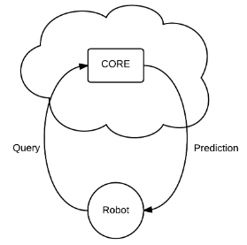
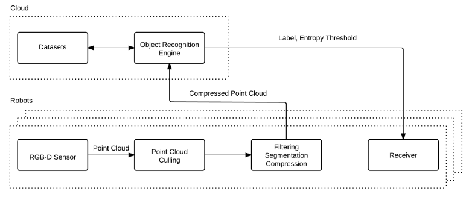

## Cloud-Based Object Recognition Engine 

### Overview
An object recognition engine needs to extract discriminative features from data
representing an object and accurately classify the object to be of practical use
in robotics. Furthermore, the classification of the object must be rapidly
performed in the presence of a voluminous stream of data. These conditions call
for a distributed and scalable architecture that can utilize a cloud computing
infrastructure for performing object recognition.

<p align="center">

</p>

This repository provides source code for our 2015 IROS paper titled "[CORE: A
Cloud-Based Object Recognition Engine for
Robotics](https://www.researchgate.net/profile/William-Beksi/publication/308837835_CORE_A_Cloud-based_Object_Recognition_Engine_for_robotics/links/60b1d562299bf1f6d5804dd7/CORE-A-Cloud-based-Object-Recognition-Engine-for-robotics.pdf)."
CORE is a framework for performing object recognition on 3D point cloud data. It
includes machine learning classifiers, a [Robot Operating
System](https://www.ros.org/) (ROS) module, and wraps existing data filters,
feature descriptors, and segmentation techniques found in the [Point Cloud
Library](https://pointclouds.org/)(PCL). The goal of CORE is to leverage cloud
computing resources for the purpose of storing data, training classifiers, and
performing object recognition tasks offloaded by network-connected robots.

### Citation

If you find this project useful, then please consider citing our work.

```
@inproceedings{beksi2015core,
  title={Core: A Cloud-Based Object Recognition Engine for Robotics},
  author={Beksi, William J and Spruth, John and Papanikolopoulos, Nikolaos},
  booktitle={Proceedings of the IEEE/RSJ International Conference on Intelligent Robots and Systems (IROS)},
  pages={4512--4517},
  year={2015}
}
```

### System Architecture

<p align="center">

</p>

### Building CORE on Ubuntu

First, install ROS followed by the software dependencies:                                                                                                        

    $ bash install.sh 

Next, build CORE:

    $ cd core  
    $ mkdir build && cd build  
    $ cmake ..  
    $ make  
    $ sudo make install  
    $ echo '/usr/local/lib' | sudo tee /etc/ld.so.conf.d/usr-local-lib.conf > /dev/null  
    $ sudo ldconfig  

Then, build the ROS module:

    $ cd core/ros  
    $ catkin_make

### Remote Server Example

#### Server Setup 

We use [CloudLab](https://www.cloudlab.us/) as our remote computing facility in
this example. We've created a profile (disk image) named
'ubuntu-16\_04-ros-kinetic-full' that captures the entire cloud environment.
This profile is shared within CloudLab under the project 'core-robotics'. It
consists of one x86 node running Ubuntu 16.04 with ROS Kinetic installed.

After starting an experiment with the above profile, clone and build CORE:

    $ git clone https://username@github.com/utarvl/core  
    $ cd core  
    $ mkdir build && cd build  
    $ cmake ..  
    $ make  
    $ sudo make install  
    $ echo '/usr/local/lib' | sudo tee /etc/ld.so.conf.d/usr-local-lib.conf > /dev/null  
    $ sudo ldconfig  

Next, build the ROS module:

    $ cd core/ros  
    $ source /opt/ros/kinetic/setup.bash  
    $ catkin_make  

Then, launch the rosbridge server node:

    $ cd core/ros   
    $ source devel/setup.bash   
    $ roslaunch rosbridge_server rosbridge_websocket.launch  

Finally, in another terminal launch the CORE server nodes:

    $ cd core/ros   
    $ source devel/setup.bash   
    $ roslaunch core_server core_server.launch  

#### Client Setup 

Follow the instructions above for building CORE on the client (robot). We'll
assume that you have an RGB-D sensor connected, such as the Asus Xtion, with the
necessary driver modules installed (OpenNI and PrimeSense). Proceed by launching
the ROS OpenNI2 driver:

    $ roslaunch openni2_launch openni2.launch depth_registration:=true 

Then, launch the CORE client nodes: 

    $ cd core/ros   
    $ source devel/setup.bash   
    $ roslaunch core_client core_client.launch server_ip_addr:=xxx.xxx.xxx.xx:9090

where 'xxx.xxx.xxx.xx' is the IP address of the CloudLab server found by using
the command 'if\_config'.

Point clouds captured by the client will be preprocessed (filtered, culled, 
compressed, etc.) and sent to the remote server for classification.

### Standalone Classification Example

In this example, we show how to use CORE for object classification using
covariance descriptors and a support vector machine (SVM).

#### Computing the Covariance Descriptor for a Set of PCD Files

First, copy over the CORE configuration file, 'core.cfg', from the 
'configuration' subdirectory. To adjust filter, segmentation, descriptor, and 
learning parameters, edit this file as necessary. Then, create a file named 
'pcd\_categories' that contains a list of absolute paths to PCD files, one 
category per line. The covariance files are written out for each category under 
the directory 'covariance\_dir':

    $ compute_covariance core.cfg pcd_categories covariance_dir  

#### Learning an SVM Model Based on Covariance Descriptors

The learning parameter, gamma, is set in the configuration file 'core.cfg'. The
model is constructed using the file 'cov\_categories' which contains the
absolute paths, one category per line, to the covariance files created in the
previous step:

    $ svm_learn_model core.cfg cov_categories  

#### SVM Classification Based on Covariance Descriptors

Now we can predict the classification labels of objects in a point cloud given 
the configuration file, the trained SVM model, and a test input PCD file:

    $ svm_predict_class core.cfg model.txt pc_1.pcd 

### License 

[](https://github.com/robotic-vision-lab/Cloud-Object-Recognition-Engine/blob/master/LICENSE)
